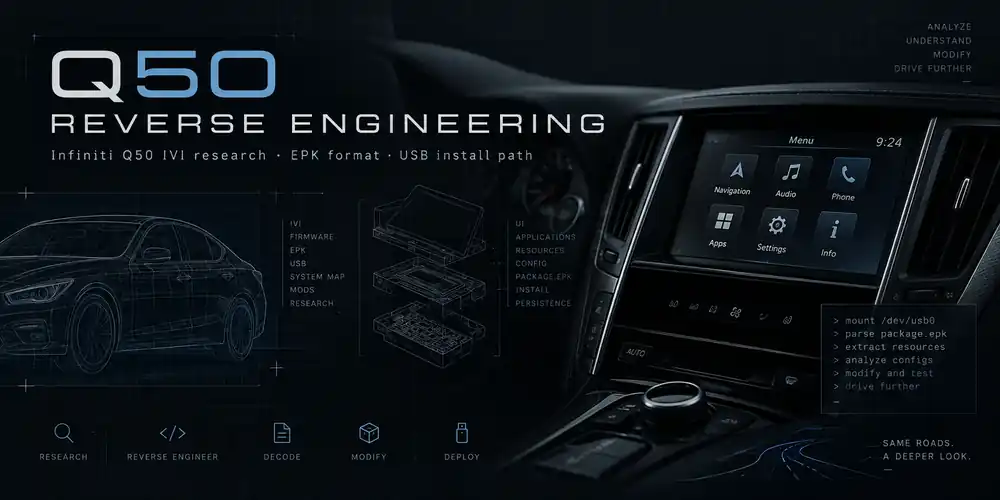

# Q50 Reverse Engineering

<p align="center">
  
</p>

This repo is my ongoing reverse engineering work on the Infiniti Q50 infotainment system.

I started looking into it because I wanted to understand how the factory system handles apps, what the `.epk` format actually is, and whether a normal person could build something that runs on the stock unit without replacing the whole infotainment system.

That turned into a much bigger rabbit hole: the Android/Linux layout, AppsManager, EPK parsing, IVI metadata, app installation, and the vehicle sensor interface.

The goal here is not to dump proprietary files or hand out everything needed to blindly copy the work. I want this repo to give people a real technical starting point, while still leaving enough work that you need to understand what you're doing.

## What I have confirmed

So far I have confirmed that:

- the Q50 infotainment image contains a Linux side and a modified Android environment
- the Android side includes Connexis/YGOMI IVI components
- AppsManager watches removable media and handles EPK packages
- the EPK v2 envelope and file-block structure can be reproduced
- a known working third-party EPK could be parsed and its APK recovered
- that working APK targets Android API 10 and uses a normal launcher activity
- the stock HomeScreen reads IVI-specific application metadata
- the working third-party app uses Android's normal `SensorManager` API for vehicle data
- RPM, temperatures, speed, throttle, torque, G-force, gear, power and TPMS sensor IDs can be mapped from that app

## Start here

- [IVI architecture](docs/architecture.md)
- [EPK format notes](docs/epk-format.md)
- [Custom app notes](docs/custom-app-notes.md)
- [Vehicle sensor map](docs/sensor-map.md)
- [Research log](docs/research-log.md)

## Tooling

There is now a small read-only EPK inspector in:

```text
tools/epk_inspect.py
```

It prints the EPK version, payload type, block count, wrapped-key length, filenames, encrypted lengths, and offsets.

I am intentionally not publishing Infiniti firmware, recovered APKs, private keys, passwords, or device-specific key material. If you want to reproduce the deeper parts of this work, you will still need to obtain and analyze software from hardware or firmware you are authorized to test.

## Current working model

```text
custom APK
   |
   v
EPK package
   |
   v
USB / AppsManager
   |
   v
IVI package manager
   |
   v
installed Android app
   |
   v
Android SensorManager
   |
   v
vehicle data
```

There are still open questions, especially around firmware-version differences, install-policy checks, and whether every Q50 software revision exposes the exact same vehicle sensor map.

## Scope

This repository is for interoperability and reverse-engineering research on hardware and software I am authorized to test.

I am not uploading original Infiniti firmware, complete proprietary source trees, recovered third-party APKs, private keys, VIN data, or other sensitive vehicle data.

See [DISCLAIMER.md](DISCLAIMER.md) for more information.

---

**Project note:** Agentic AI was used as a research and editing assistant during parts of this project.
