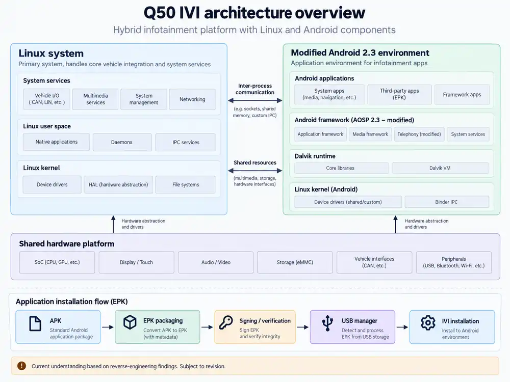

# IVI architecture notes

The current working model of the Q50 infotainment system is a hybrid platform: a Linux-oriented side handles much of the system-level work while a heavily modified Android 2.3 environment handles applications and IVI-facing services.

The Android environment does not behave like a normal consumer Android device. Its application format, install path, and supporting services appear to be shaped by the IVI platform rather than by the standard Android package-install workflow.



The diagram is a working model derived from the findings documented in this repository. Component boundaries and parts of the install flow still need confirmation against additional software and hardware observations.

## Android-side findings

The decompiled software contains the following package families:

```text
com.connexis.ivi.utils.epk
com.connexis.ivi.utils.epk.v2
com.connexis.ivi.utils.epk.v2_2
com.connexis.ivi.utils.epk.v2_3
```

These classes parse EPK packages and represent entries, envelopes, and payloads. This supports the conclusion that EPK handling is built into the IVI application-management software rather than being a generic Android APK install path.

## Working install model

The install path currently being traced is:

```text
Application APK
      |
      v
EPK package creation
      |
      v
Signing / verification
      |
      v
USB manager
      |
      v
IVI install process
```

The exact boundary between Android and Linux is intentionally left open until code or hardware behavior confirms it.

## What this proves

- EPK parsing is represented in the IVI software stack.
- The system has a package-management path distinct from simply copying an APK to removable media.
- The observed architecture is consistent with separate application, packaging, USB-management, and installation stages.

## What is still unknown

- Which component creates the final EPK file.
- What is signed, and where the signature is checked.
- What the 256-byte key field represents for each package variant.
- Which service receives an EPK from the USB manager.
- Whether Linux performs verification before Android receives the package.
- Which payload types are supported across software revisions.
- Whether the versioned EPK parsers have materially different behavior.

This page is a working map, not a claim of a complete platform architecture.
